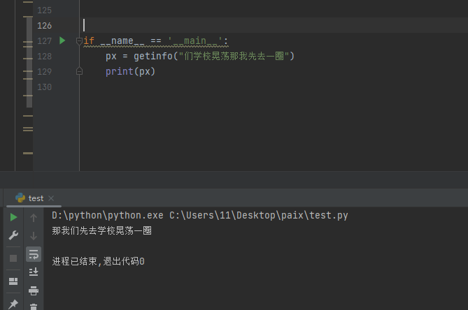

### 语义排序训练


## 注意
 
最多排序20个字

## 数据集准备

#  把txt文件是utf-8编码文件放入file文件夹中
目录格式:
---

 file

--- a.txt

--- b.txt

--- ...

---


## 训练脚本

```
python train.py
```

## 测试脚本

```
python test.py
```

知识星球 : https://t.zsxq.com/14LP2ulsk


国内 al系列 jy rs可找这位大佬 微信：z596918978

 


